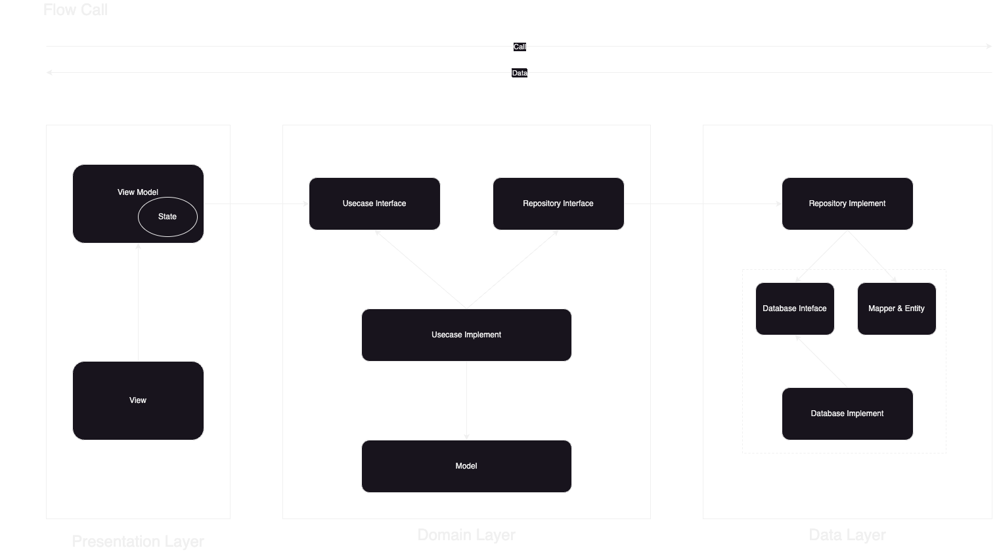

# flutter_base_riverpod

A Flutter base source about Riverpod

## Getting Started
Using Libaries
1. State-management: riverpod
2. Route: go-router
3. Json & Mapper: freezed, json
4. Networking: dio
5. Localization: intl
6. Storage local: shared_preferences
7. Database: sqflite

### Architecture Diagram


### Folder Structure
```
libs/
    - data/                                         <--- data layer
        - database/                                 <--- handle database
        - entity/
        - mapper/
        - repositories/                             <--- repository implement
    - domain/                                       <--- domain layer
        - models/                                   
        - repositories/                             <--- repository interface
        - usecases/
    - presentation/                                 <--- presentation layer
        - features/                                 <--- contains all feature of application
        - state/                                    <--- define state class
    - shared/                                       <--- folder contains code shared across features
        - configs/                                  <--- config environment
        - extensions/
        - networking/                               <--- handle networking
        - routes/                                   <--- config all router of application
        - storage/                                  <--- storage local - shared_preferences
        - themes/
        - widgets/
    - main.dart                                     <--- entry point
```

### Các vấn đề chưa xử lý trong code
- authen
- refresh token có check interceptors lock
- force update - deeplink
- theme
- config env riêng cho ios, aos
- back trong go_route
- tabbar, drawer trong go_route
- tách riêng validator
- logging - debug

